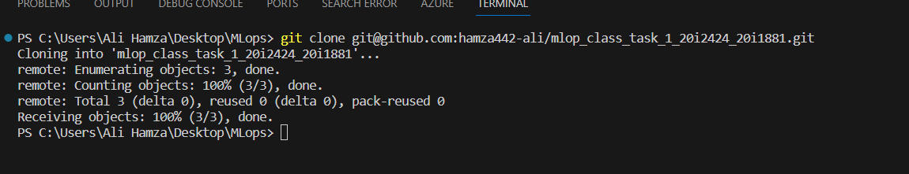
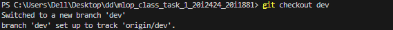
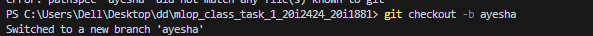
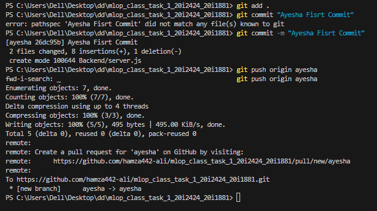

# mlop_class_task_1_20i2424_20i1881
<<<<<<< HEAD
 git clone https://github.com/hamza442-ali/mlop_class_task_1_20i2424_20i1881.git
 

  git checkout dev
  
  git checkout -b ayesha
  
  made a backend/frontend folder
  git add . 
  git commit "Ayesha Fisrt Commit"
  git push 
  
=======

 

>>>>>>> 828d163a564ba7d63604928332a54985079be7d3
